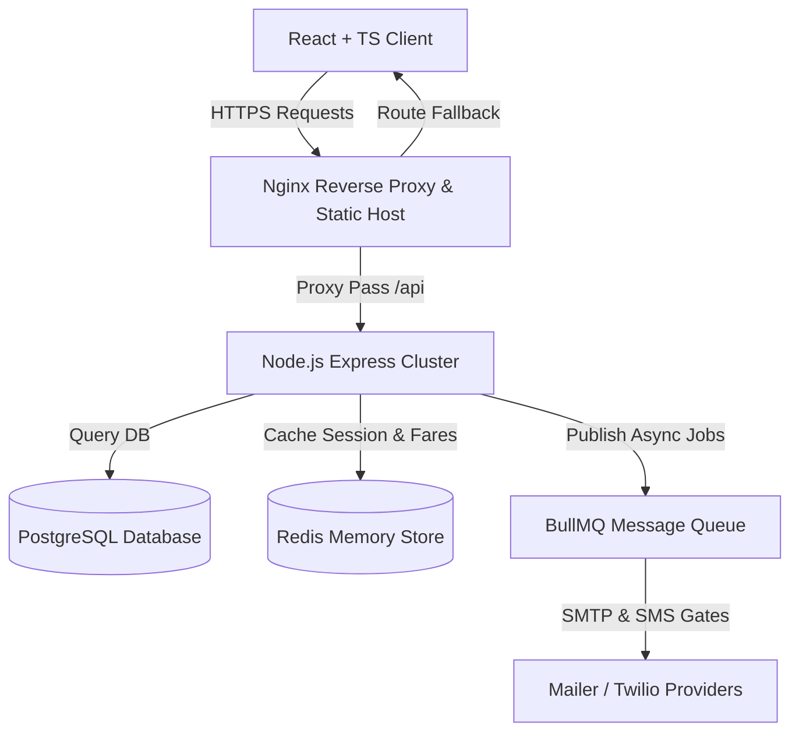

# Kemet Luxury Travel - Enterprise System Architecture

This document maps out the high-level system architecture and operational conventions of the **Kemet Luxury Travel** enterprise platform.

## 1. System Topology Overview

Kemet utilizes a highly scalable, decoupled **Client-Server Relational Caching Topology** designed for horizontal scaling, low latencies, and high security.

---

## 2. Decoupled Service Layers (Backend)

The Express backend application enforces **Clean Separation of Concerns (SoC)** using a modular service pattern:

1. **Routing Layer (`src/routes`)**:
   - Parses HTTP methods and namespaces api versions (e.g. `/api/v1`).
   - Hooks input schemas directly to Zod validation filters before reaching controllers.
2. **Controller Layer (`src/controllers`)**:
   - Sanitizes requests body parameters.
   - Delegates business logistics to specialized service objects.
   - Standardizes response templates (Success code vs error stack boundaries).
3. **Service Layer (`src/services`)**:
   - Houses transactional booking pipelines, Dynamic pricing multipliers, and AI itinerary builders.
   - Decoupled from direct HTTP libraries (can be easily ported to CLI scripts or microservice nodes).
4. **Data Access Layer (`prisma`)**:
   - Normalized database tables mapped via Prisma ORM for type-safe query execution.

---

## 3. High Performance Caching Strategy

To achieve sub-100ms response targets during high traffic seasons, Kemet implements active Redis integration:
- **Rate Limit Counter**: Stores IP request trackers to prevent server exhaustion.
- **Listing Catalogs**: Caches luxury hotel and flight catalogs with custom TTLs (Time-To-Live).
- **Session Tokens**: Cross-references rotated refresh tokens to avoid database locks during customer navigating.
